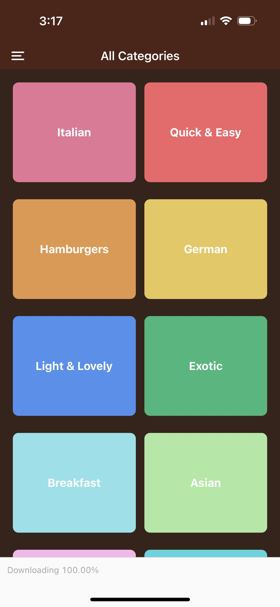
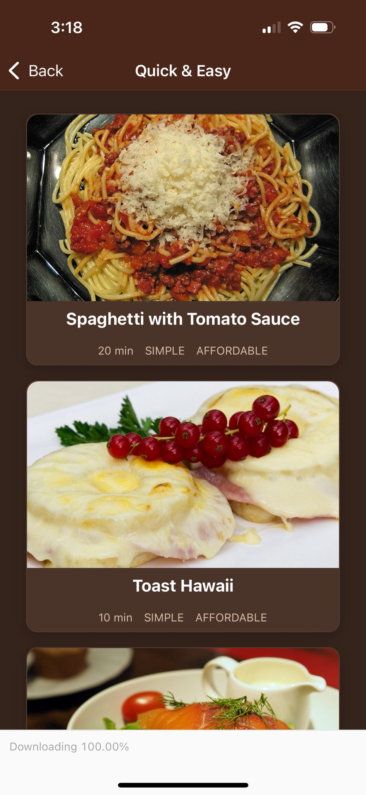
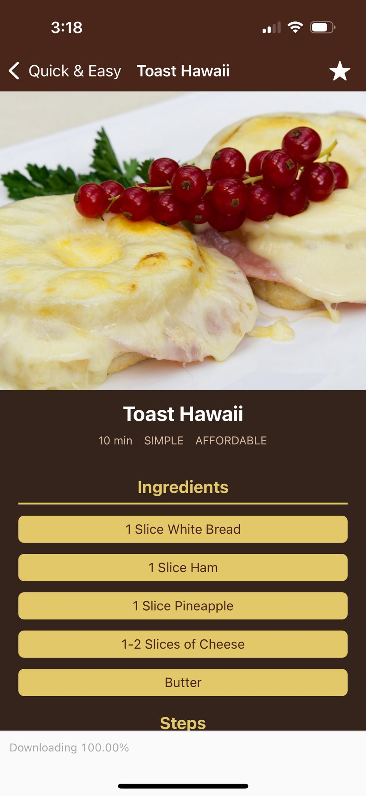

# Meals (React Native App)

A mobile app built with **React Native** and **Expo** where users can browse meals by category, view detailed recipes, and mark their favorites. Favorites are managed globally using **Redux Toolkit**, and navigation is handled with **React Navigation** (Drawer + Stack).

---

## Screenshots

<p align="center">
  
  
  
</p>

---

## Features

- **Categories Screen**: Browse meals grouped by category.
- **Meals Overview Screen**: See all meals in a selected category.
- **Meal Detail Screen**: View ingredients, steps, and details for each recipe.
- **Favorites Screen**: Mark/unmark meals as favorites and access them quickly.
- **Redux Toolkit**: Global state management for favorites.
- **Drawer Navigation**: Switch easily between Categories and Favorites.
- **Stack Navigation**: Navigate from categories → meals overview → meal detail.
- **Custom styling** with a shared theme file (`constants/theme.js`).
- Dummy data (`dummy-data.js`) used to populate meals and categories.

---

## Tech Stack

- [React Native](https://reactnative.dev/)
- [Expo](https://expo.dev/)
- [React Navigation](https://reactnavigation.org/)
  - `@react-navigation/native`
  - `@react-navigation/native-stack`
  - `@react-navigation/drawer`
- [Redux Toolkit](https://redux-toolkit.js.org/)
- `react-native-safe-area-context`
- `@expo/vector-icons`

---

## Installation & Running

1. Clone the repository:

   ```bash
   git clone https://github.com/maitepv87/rn-meals-app.git
   cd rn-meals-app
   ```

2. Install dependencies:

   ```bash
    npm install
     # or
    yarn install
   ```

3. Start the project with Expo:

   ```bash
   npm start
   # or
   expo start
   ```

4. Scan the QR code with the Expo Go app on your mobile device.
